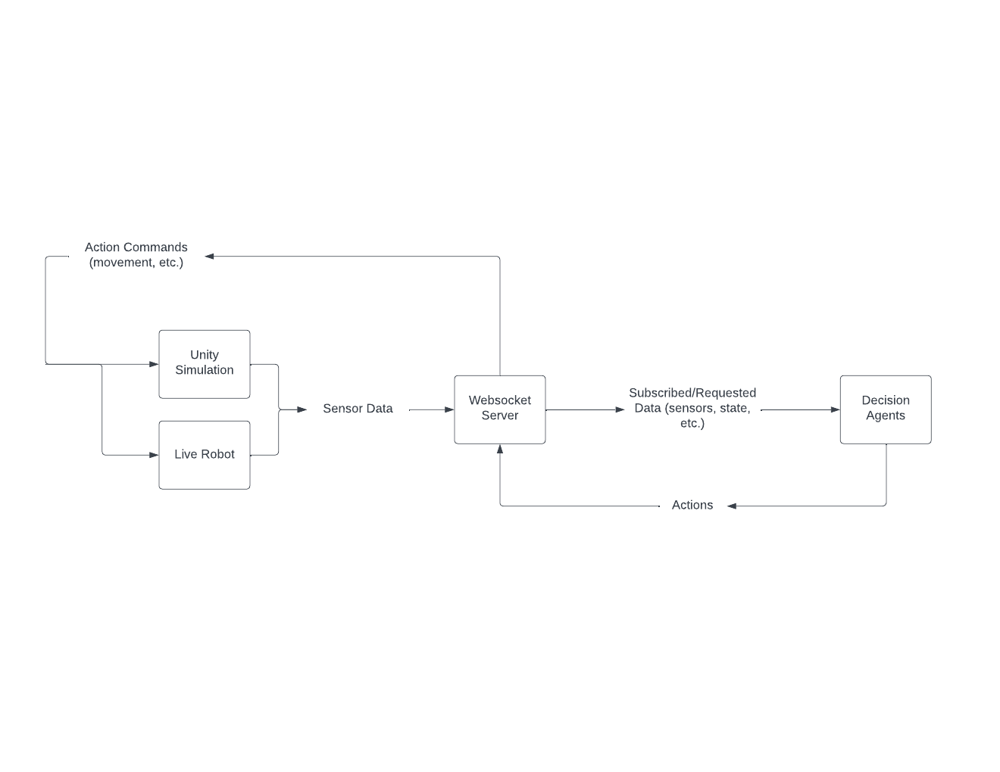

# Robot Sim Communication Protocol

The overarching goal with the project architecture is to allow for the easiest migration between simulation and reality. With this in mind, all projects are assumed to follow the given structure:



Because the decision agents are separated from direct communication with a simulation, it *can* translate to an easier switch to real systems. This is assuming that you are keeping sensors and constraints within Unity as realistic as possible.

For each project, if there are any special sensors in use that do not have a prebuilt asset, or for a full physics simulation of a robot not already available, you will need to write a communication layer between the server and the sim/robot. There will be examples of how to write these below, and you can look at the prebuilt examples for how it should work as well.

## Messages

Robot Sim messages are written in JSON (at the time of writing, I am considering moving to Google Protobufs instead, but JSON until there is a limit from JSON).

They all follow a common format, which is important for the websocket server to correctly handle it.

```JSON
{
  purpose: Purpose,
  dataType: string,
  
}
```